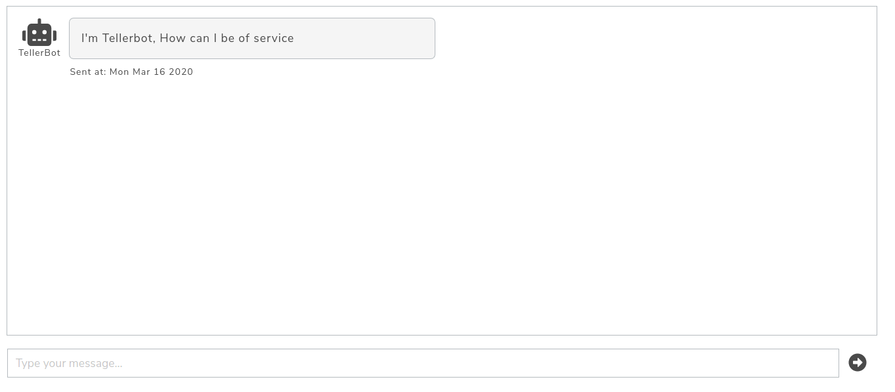
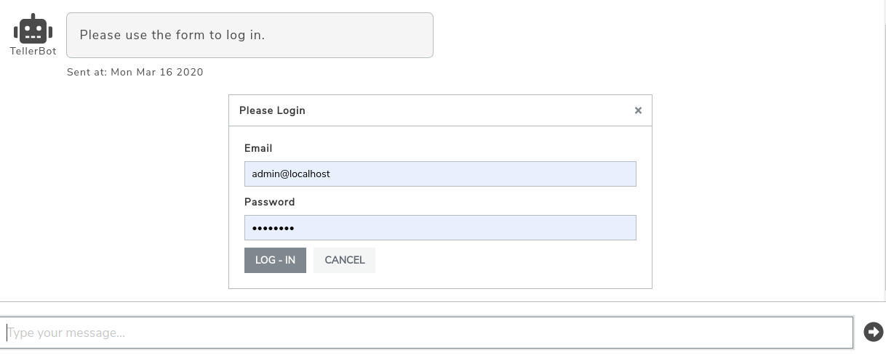
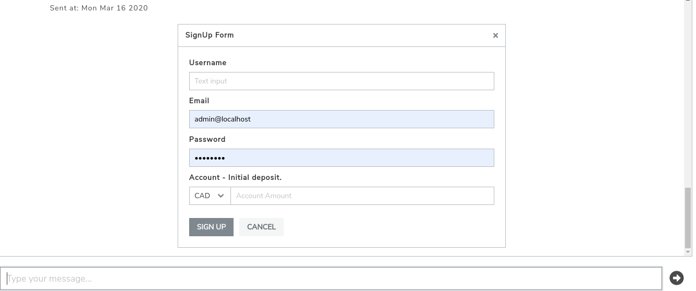
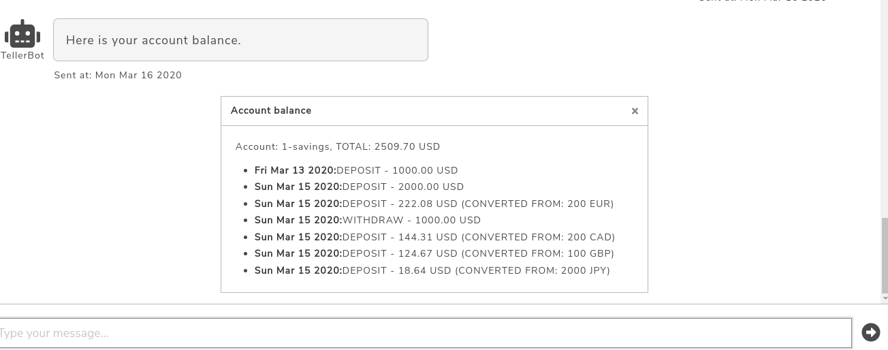
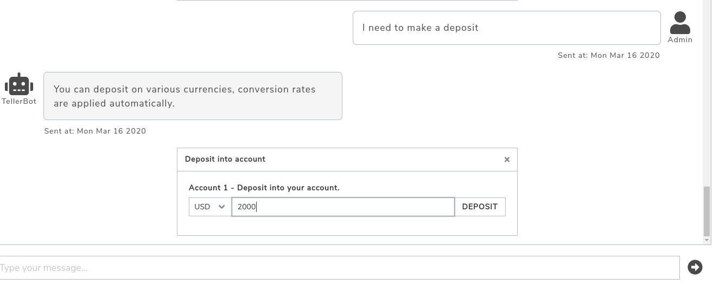
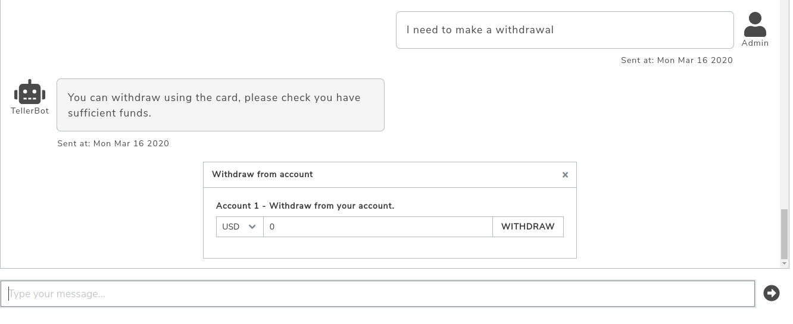
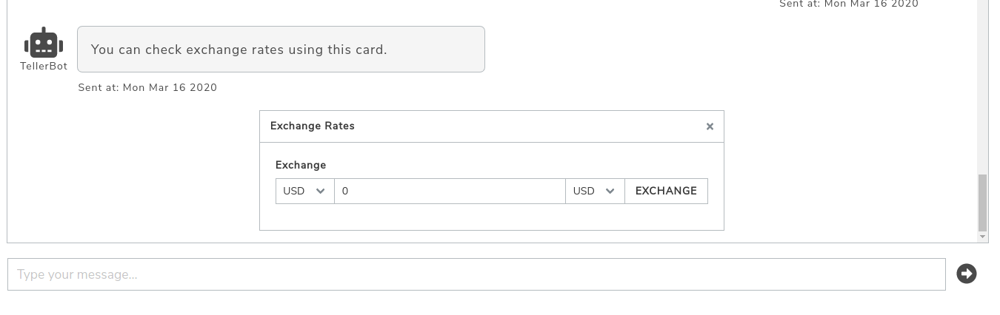
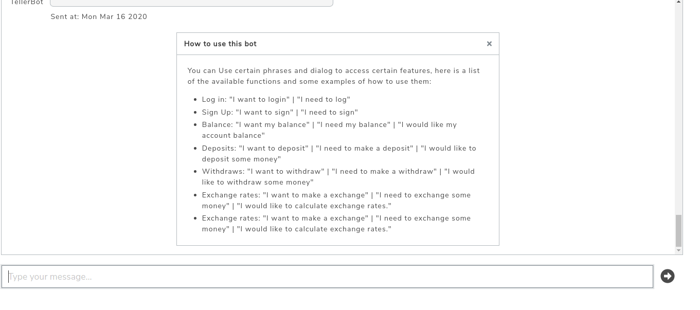

# **Tellerbot**

## __What is Tellerbot__
Tellerbot is a simple and intuitive way to make requests to your local bank, using a minimalistic chat ui, you could easily log in, check your account balance and make simple operations like deposits, withdrawals and check exchange rates, just type it and and the bot will do the rest. 

This project was created using:
* (PHP) Laravel Framework 7
* (Javascript) node 12.3.1
* (Javascript) React 16.13.0
* (CSS) Bulma 0.8
* Mysql 5.7
* Docker 18.06.3
* Docker Compose 1.22.0

## __How to Install__

### 1. Clone Project
Or the easy way, this is the recommended way to install Tellerbot:
* Clone this repository:
    
    `git clone git@github.com:GooseCoder/tellerbot.git`

### 2.a. Setup Environment (Docker)

Install docker (18.06.3) and docker compose (1.22.0), here is a good guide to get docker up and running: https://docs.docker.com/install/ and for compose: https://docs.docker.com/compose/install/

* From the project main folder just run:
    
    `docker-compose up -d`

The previous step created the application environment but to run the project we need some data to get started, run the following commands:

1. `docker exec -it tellerbot_tellerbot-api_1 bash `
2. `php artisan migrate`
3. `php artisan db:seed`

One recommendation is to check that the first command starts a bash session inside the container, if not, neither of the following commands will execute the data setup

### 2.b. Setup Environment (LAMP, WAMP or MAMP)

Is required an environment with:
* PHP >= 7.2 (https://laravel.com/docs/7.x#server-requirements)
* Mysql 5.7 
* node 12.3.1
* composer package manager

Then configure the laravel api application from the tellerbot-api folder:
1. Run `composer install`
2. Create a database named: api-data
3. Modify the .env file to modify the DB_HOST variable to point to the right database host, usually `localhost`
4. Run `php artisan migrate` to setup the required tables.
4. Run `php artisan db:seed` to seed the database with the initial data
6. Run `php artisan serve --host=0.0.0.0 --port=8181` to serve the api

To configure the react ui from the tellerbot-web folder:
1. Edit the file `src/components/services/ConfigurationService.js` to change the api host address if required
2. Run `npm install` to install dependencies
3. Run `npm start` to start the ui server

## __How to use Tellerbot__

Once finished the bot is ready for action. If there were no problems you could access the bot UI on this address:

    localhost:3000

You can input certain phrases and dialog into the message box at the bottom to access certain features:

Here is a list of the available functions and some examples of how to use them:

### Login

You can type something like: "I want to login" or "I need to log". This should open a card:

You only need to add the email and password of a valid user the demo credentials are 

    email: admin@member.com
    password: sample

### Sign Up

You can type something like: "I want to sign" or "I need to sign"

This card need to be filled in order to create a new user. The last field is required to create a new account linked to this user, it will be created using that code to set the currency of the account.

### Balance

You can type something like: "I want my balance", "I need my balance" or "I would like my account balance"

If you are a logged user or just created an account, you will be able to use more features like getting your account balance. This list will show you the number of deposits and withdrawals and the currency used in each case. Each transaction has the conversion info if the money was exchanged during the deposit or withdrawal

### Deposits

You can type something like: "I want to deposit", "I need to make a deposit" or "I would like to deposit some money"

It just need an amount and currency code to make the transaction. All transactions made in a currency different than tha account currency are converted into the account currency

### Withdraws

You can type something like: "I want to withdraw", "I need to make a withdraw" or "I would like to withdraw some money"

It just need an amount and currency code to make the transaction. All transactions made in a currency different than tha account currency are converted into the account currency

### Exchange rates

You can type something like: "I want to make a exchange", "I need to exchange some money" or "I would like to calculate exchange rates."

The user needs to add two codes the orignal currency and the target currency the amount in the middle will be converted pressing the exchange button.

### Help

If you want to see this dialog info inside the chat, you could just type something like:

    Could you help me?

A small help card should appear bellow the message.